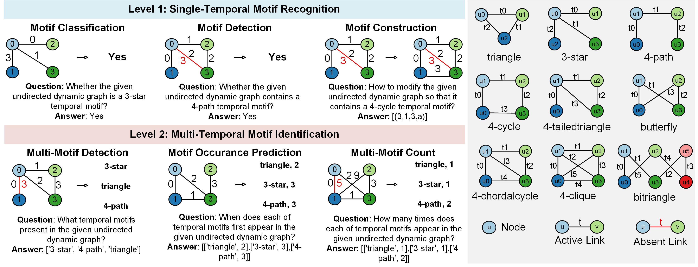

# LLMTM: Benchmarking and Optimizing LLMs for Temporal Motif Analysis in Dynamic Graphs

## Abstract

The widespread application of Large Language Models (LLMs) has motivated a growing interest in their capacity for processing dynamic graphs. Temporal motifs, as an elementary unit and an important local property of dynamic graphs which can directly reflect anomalies and unique phenomena, are essential for understanding their evolutionary dynamics and structural features. 

However, leveraging LLMs for temporal motif analysis on dynamic graphs remains relatively unexplored. In this paper, we systematically study LLM performance on temporal motif-related tasks. Specifically, we propose a comprehensive benchmark, LLMTM (Large Language Models in Temporal Motifs), which includes six tailored tasks across nine temporal motif types. 

We then conduct extensive experiments to analyze the impacts of different prompting techniques and LLMs (including nine models such as openPangu-Embedded-7B-DeepDiver, the Qwen series, QwQ-32B, GPT-4o-mini, Deepseek-R1, and o3) on model performance. Informed by our benchmark findings, we develop a tool-augmented LLM agent that leverages precisely engineered prompts to solve these tasks with high accuracy. Nevertheless, the high accuracy of the agent incurs a substantial cost. 

To address this trade-off, we propose a simple yet effective structure-aware dispatcher that considers both the dynamic graph's structural properties and the LLM's cognitive load to intelligently dispatch queries between the standard LLM prompting and the more powerful agent. Our experiments demonstrate that the structure-aware dispatcher effectively maintains high accuracy while reducing cost.

## Supported Motif Types

- **triangle**: 3-node 3-edge triangle
- **3-star**: 4-node 3-edge star structure
- **4-path**: 4-node 3-edge path
- **4-cycle**: 4-node 4-edge cycle
- **4-tailedtriangle**: 4-node 4-edge tailed triangle
- **butterfly**: 4-node 4-edge butterfly
- **4-chordalcycle**: 4-node 5-edge chordal cycle
- **4-clique**: 4-node 6-edge clique
- **bitriangle**: 6-node 6-edge bitriangle

## Benchmark

We implement and evaluate four prompting techniques (including zero/one-shot and zero/one-shot Chain-of-Thought) across nine LLMs, encompassing closed-source models like o3, Deepseek-R1, and GPT-4o-mini, as well as open-source models such as openPangu-Embedded-7B-DeepDiver, DeepSeek-R1-Distill-Qwen-7B, DeepSeek-R1-Distill-Qwen-14B, DeepSeek-R1-Distill-Qwen-32B, Qwen2.5-32B, and QwQ-32B. We have open-sourced our code for all ten tasks, which are grouped into three levels: Level 0 (Fundamental Dynamic Graph Understanding), Level 1 (Single-Temporal Motif Recognition), and Level 2 (Multi-Temporal Motif Identification).


To run the benchmark code, set `--api 1`. The code also supports running models locally; to do so, modify the model path in the LLMDyG_Motif/runner.py file.

## Tool-Augmented LLM Agent

We design a tool-augmented LLM agent, which leverages algorithms and meticulously engineered prompts to solve all tasks in our benchmark with high accuracy.

To run the tool-augmented LLM agent code, set `--use_agent 1`.

## Trade-off Between Accuracy and Cost

We focuse on the ”Judge Contain Motif” task and propose structure-aware dispatcher, a framework that strategically routes a given problem to either a standard LLM or a tool-augmented agent.


You can generate dynamic graphs of any specified size that contain a specific temporal motif. To set the number of edges, use the parameter p > 1. To run the structure-aware dispatcher code, set `--balance 1`.

## Installation

```bash
# Install dependencies
pip install -r requirements.txt
```

### System Requirements
- Python 3.8+
- CUDA support (optional, for GPU acceleration)

### Environment Variables
```bash
export CUDA_VISIBLE_DEVICES="0,1,2,3"  # optional
```
### Dataset
We included our dataset in the log.

## Deploy openPangu-Embedded-7B-DeepDiver
## Clone and install
```
git clone https://gitcode.com/ascend-tribe openPangu-Embedded-7B-DeepDiver.git
cd deepdiver_v2
pip install -r requirements.txt
```
### Install CANN manually 
(For the Docker method, please refer to https://ai.gitcode.com/ascend-tribe/openPangu-Embedded-7B-DeepDiver/blob/main/README_EN.md)
## Create a virtual environment
```
python -m venv vllm-ascend-env
source vllm-ascend-env/bin/activate
```
## Install required python packages.
```
pip3 install -i https://pypi.tuna.tsinghua.edu.cn/simple attrs 'numpy<2.0.0' decorator sympy cffi pyyaml pathlib2 psutil protobuf scipy requests absl-py wheel typing_extensions
```
### Download 8.2.rc1 CANN package manually
Refer to https://support.huawei.com/enterprisesearch/#/index?keyword=CANN&lang=zh&searchType=SUPE_SW&sortType=Relevance&outside=0&hasChangeLang=true download Ascend-cann-toolkit_8.2.RC1_linux, Ascend-cann-kernels-910b_8.2.RC1_linux, Ascend-cann-nnal_8.2.RC1_linux

## Install the CANN package
```
chmod +x ./Ascend-cann-toolkit_8.2.RC1_linux-"$(uname -i)".run
./Ascend-cann-toolkit_8.2.RC1_linux-"$(uname -i)".run --full
source /usr/local/Ascend/ascend-toolkit/set_env.sh
chmod +x ./Ascend-cann-kernels-910b_8.2.RC1_linux-"$(uname -i)".run
./Ascend-cann-kernels-910b_8.2.RC1_linux-"$(uname -i)".run --install
chmod +x ./Ascend-cann-nnal_8.2.RC1_linux-"$(uname -i)".run
./Ascend-cann-nnal_8.2.RC1_linux-"$(uname -i)".run --install
source /usr/local/Ascend/nnal/atb/set_env.sh
```
## Config pip mirror
```
pip config set global.index-url https://mirrors.tuna.tsinghua.edu.cn/pypi/web/simple
pip config set global.extra-index-url "https://download.pytorch.org/whl/cpu/ https://mirrors.huaweicloud.com/ascend/repos/pypi"
```

## Install vLLM
```
git clone --depth 1 --branch v0.9.2 https://github.com/vllm-project/vllm
cd vllm
VLLM_TARGET_DEVICE=empty pip install -v -e .
cd ..
```
## Install vLLM Ascend
```
git clone  --depth 1 --branch v0.9.2 https://github.com/vllm-project/vllm-ascend.git
cd vllm-ascend
pip install -v -e .
cd ..
```
## Copy Pangu's Modeling Files
open_pangu.py and __init__.py can be found at http://ai.gitcode.com/ascend-tribe/openpangu-embedded-7b-model/tree/main/inference/vllm_ascend/models
```
cp ./vllm_ascend/open_pangu.py /vllm-workspace/vllm-ascend/vllm_ascend/models/
cp ./vllm_ascend/__init__.py /vllm-workspace/vllm-ascend/vllm_ascend/models/
```
## Run
```
bash /home/ma-user/work/LLMDyG_Motif/start_vllm.sh
```
### Done!

## File Organization

The files in this repo are organized as follows:

```text
.
├── LLMDyG_Motif/
│   ├── runner.py                 # End-to-end pipeline (gen/run/check/eval/show)
│   ├── API/
│   │   └── api.py                # OpenAI-compatible API wrapper and logging
│   ├── Agent/
│   │   ├── agent_manager.py      # LangChain-based tool-augmented LLM agent
│   │   └── tools.py              # Temporal Motif tools exposed to the agent
│   └── utils/
│       ├── data.py               # Dynamic graph generators (ER, motif-based, etc.)
│       ├── prompt.py             # Prompt builders for different tasks/modes
│       ├── visualization.py      # Static snapshots and GIF visualization helpers
│       ├── xgboost.joblib        # Dispatcher model info (Balance mode)
│       └── task/                 # Task definitions (Level 0/1/2)
│           ├── base.py
│           ├── judge_is_motif.py
│           ├── judge_contain_motif.py
│           ├── modify_motif.py
│           ├── multi_motif_judge.py
│           ├── when_multi_motif_exist.py
│           ├── multi_motif_count.py
│           ├── sort_edge.py
│           ├── what_edges.py
│           ├── when_link_and_dislink.py
│           └── reverse_graph.py
├── scripts/
│   └── example/
│       ├── run_one_task.py       # Single-task entry (gen/run/check/eval/show/clear)
│       ├── all_tasks.sh          # Ready-to-use examples for multiple tasks
│       └── config.py             # Arguments and defaults
├── images/                       # Figures used in README
│   ├── tasks.png
│   └── dispatcher.png
├── logs/                         # Generated at runtime (relative path)
│   └── ...                       # Data, results, and visualizations. (We put our dataset here)
└── README.md
```

## Quick Start

We provide scripts in the LLMDyG_Motif/scripts/example folder. To run them, please set your openai.base_url and openai.key.

### 1. Data Generation
```bash
python scripts/example/run_one_task.py --task judge_is_motif --T 5 --N 3 --p 3 --motif 1 --motif_name triangle --k 0 --num_seed 20 -t gen
```

### 2. Run Task
```bash
python scripts/example/run_one_task.py --task judge_is_motif --T 5 --N 3 --p 3 --motif 1 --motif_name triangle --k 0 --api 1 --model gpt-4o-mini --key ×××× --num_seed 20 -t run
```

### 3. Evaluate Results
```bash
python scripts/example/run_one_task.py --task judge_is_motif --T 5 --N 3 --p 3 --motif 1 --motif_name triangle --k 0 --api 1 --model gpt-4o-mini --key ×××× --num_seed 20 -t eval
```

You can modify the data generation parameters (--T, --N, --p) and the task name (e.g., --task judge_contain_motif) to generate data and run other tasks. The run commands for all tasks are provided in the script LLMDyG_Motif/scripts/example/all_tasks.sh.

### 4. Configuration Modes

The project supports three main modes controlled by parameters:

- **API Mode** (`--api 1`): Direct API calls to LLM
- **Agent Mode** (`--use_agent 1`): Tool-Augmented LLM Agent 
- **Balance Mode** (`--balance 1`): Structure-aware dispatcher using XGBoost

