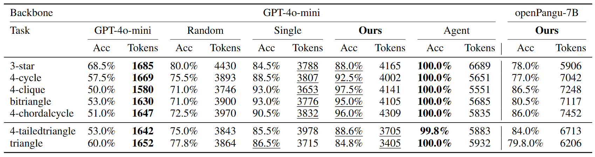

# LLMTM: Benchmarking and Optimizing LLMs for Temporal Motif Analysis in Dynamic Graphs

[](https://www.python.org/downloads/)
[](https://pytorch.org/)
[](LICENSE)
[](https://aaai.org/conference/aaai/aaai-26/)

Official PyTorch implementation of **"LLMTM: Benchmarking and Optimizing LLMs for Temporal Motif Analysis in Dynamic Graphs"** accepted at AAAI 2026.

> **Note**: This repository contains code and resources for reproducing the results presented in our paper.

## 📋 Table of Contents

- [Abstract](#abstract)
- [Benchmark](#Benchmark)
- [Architecture](#architecture)
- [Requirements](#requirements)
- [Installation](#installation)
- [Dataset](#dataset)
- [Usage](#usage)
  - [Run](#run)
  - [Evaluation](#evaluation)
  - [Modes](#modes)
- [Project Structure](#project-structure)
- [Results](#results)
- [Citation](#citation)
- [Acknowledgments](#acknowledgments)
- [License](#license)
- [Contact](#contact)

## 📝 Abstract

The widespread application of Large Language Models (LLMs) has motivated a growing interest in their capacity for processing dynamic graphs. Temporal motifs, as an elementary unit and an important local property of dynamic graphs which can directly reflect anomalies and unique phenomena, are essential for understanding their evolutionary dynamics and structural features. 

However, leveraging LLMs for temporal motif analysis on dynamic graphs remains relatively unexplored. In this paper, we systematically study LLM performance on temporal motif-related tasks. Specifically, we propose a comprehensive benchmark, LLMTM (Large Language Models in Temporal Motifs), which includes six tailored tasks across nine temporal motif types. 

We then conduct extensive experiments to analyze the impacts of different prompting techniques and LLMs (including nine models such as openPangu-Embedded-7B-DeepDiver, the Qwen series, QwQ-32B, GPT-4o-mini, Deepseek-R1, and o3) on model performance. Informed by our benchmark findings, we develop a tool-augmented LLM agent that leverages precisely engineered prompts to solve these tasks with high accuracy. Nevertheless, the high accuracy of the agent incurs a substantial cost. 

To address this trade-off, we propose a simple yet effective structure-aware dispatcher that considers both the dynamic graph's structural properties and the LLM's cognitive load to intelligently dispatch queries between the standard LLM prompting and the more powerful agent. Our experiments demonstrate that the structure-aware dispatcher effectively maintains high accuracy while reducing cost.

## Benchmark

We implement and evaluate four prompting techniques (including zero/one-shot and zero/one-shot Chain-of-Thought) across nine LLMs, encompassing closed-source models like o3, Deepseek-R1, and GPT-4o-mini, as well as open-source models such as openPangu-Embedded-7B-DeepDiver, DeepSeek-R1-Distill-Qwen-7B, DeepSeek-R1-Distill-Qwen-14B, DeepSeek-R1-Distill-Qwen-32B, Qwen2.5-32B, and QwQ-32B. We have open-sourced our code for all ten tasks, which are grouped into three levels: Level 0 (Fundamental Dynamic Graph Understanding), Level 1 (Single-Temporal Motif Recognition), and Level 2 (Multi-Temporal Motif Identification).


## 🏗️ Architecture

We train a lightweight XGBoost classifier using a dataset of 1500 instances with varying scales and difficulties across five motif types (e.g., 3-star, 4-cycle), which tools LLMs to form an Agent acting as a ”Structure-Aware Dispatcher”. 

LLMTM framework, first utilizes "Structure-Aware Dispatcher" to extracts the dynamic graph from natural language and then predicts a query’s difficulty and strategically routes it down one of two paths: simple queries are sent to a standard LLM for a low-cost answer, while complex ones are handled by our tool-augmented agent. The agent follows a workflow of task planning, tool selection, tool calling, and response generation to achieve high accuracy, albeit at a greater computational cost.

The LLMTM framework consists of:
- **Temporal Graph Understand**: Structure-Aware Dispatcher
- **LLM Backbone**:  Standard LLM Prompting
- **Optimization Layer**: Tool-Augmented Agent


## 🔧 Requirements

- Python >= 3.8
- PyTorch >= 2.0.0
- CUDA >= 11.8 (for GPU acceleration)

### Dependencies

```
torch>=2.0.0
numpy>=1.24.0
scipy>=1.10.0
networkx>=3.0
transformers>=4.30.0
torch-geometric>=2.3.0
tqdm>=4.65.0
matplotlib>=3.7.0
scikit-learn>=1.3.0
pandas>=2.0.0
openai>=1.93.0
langchain>=0.3.26
langchain-core>=0.3.72
langchain-openai>=0.3.28
```

## 💿 Installation

### 1. Clone the repository

```bash
git clone https://github.com/Wjerry5/LLMTM.git
cd LLMTM
```

### 2. Create a virtual environment

```bash
# Using conda (recommended)
conda create -n llmtm python=3.9
conda activate llmtm

# Or using venv
python -m venv venv
source venv/bin/activate  # On Windows: venv\Scripts\activate
```

### 3. Install dependencies

```bash
# Install PyTorch (adjust based on your CUDA version)
pip install torch torchvision torchaudio --index-url https://download.pytorch.org/whl/cu118

# Install other requirements
pip install -r requirements.txt
```

## 📊 Dataset

### Supported Datasets
We included our dataset in data.zip, and we also support real-world datasets such as Enron.

### Data Generation
```bash
python ../scripts/example/run_one_task.py --task judge_contain_motif --T 5 --N 10 --p 0.3 --motif 1 --motif_name 4-path --use_agent 1 --k 0 --model pangu_auto --num_seed 20 -t gen
```

### Dataset Format

```
log(data)/
└── task_name/
    └── T10_N6_P6.0_seed0
              ├── graph.json # dynamic graph quadruples
              └── qa.json # question-answer pair

```

Example `graph.json`:
```
[source,target,timestamp,edge_type]
[1, 3, 0, "a"]
[4, 5, 2, "a"]
```

## 🚀 Usage

### Run
```bash
python ../scripts/example/run_one_task.py --task judge_contain_motif --T 5 --N 10 --p 0.3 --motif 1 --motif_name 4-path --use_agent 1 --k 0 --model pangu_auto --num_seed 20 -t run
```
You can modify the data generation parameters (--T, --N, --P) and the task name (e.g., --task judge_contain_motif) to generate data and run other tasks. The run commands for all tasks are provided in the script LLMTM/scripts/example/*.sh.

### Evaluation

```bash
python ../scripts/example/run_one_task.py --task judge_contain_motif --T 5 --N 10 --p 0.3 --motif 1 --motif_name 4-path --use_agent 1 --k 0 --model pangu_auto --num_seed 20 -t eval
```

### Modes

The project supports three main modes controlled by parameters:

- **API Mode** (`--api 1`): Direct API calls to LLM
- **Agent Mode** (`--use_agent 1`): Tool-Augmented LLM Agent 
- **Balance Mode** (`--balance 1`): Structure-aware dispatcher using XGBoost


## 📁 Project Structure

```text
.
├── LLMTM/
│   ├── runner.py                 # End-to-end pipeline (gen/run/check/eval/show)
│   ├── API/
│   │   └── api.py                # OpenAI-compatible API wrapper and logging
│   ├── Agent/
│   │   ├── agent_manager.py      # LangChain-based tool-augmented LLM agent
│   │   └── tools.py              # Temporal Motif tools exposed to the agent
|   ├── Balance/
│   │   ├── agent_manager.py      # LangChain-based tool-augmented LLM agent
│   │   └── tools.py              # Xgboost classifier exposed to the agent
│   └── utils/
│       ├── data.py               # Dynamic graph generators (ER, motif-based, etc.)
│       ├── prompt.py             # Prompt builders for different tasks/modes
│       ├── visualization.py      # Static snapshots and GIF visualization helpers
│       ├── xgboost.joblib        # Dispatcher model info (Balance mode)
│       └── task/                 # Task definitions (Level 0/1/2)
│           ├── base.py
│           ├── judge_is_motif.py
│           ├── judge_contain_motif.py
│           ├── modify_motif.py
│           ├── multi_motif_judge.py
│           ├── when_multi_motif_exist.py
│           ├── multi_motif_count.py
│           ├── sort_edge.py
│           ├── what_edges.py
│           ├── when_link_and_dislink.py
│           └── reverse_graph.py
├── scripts/
│   └── example/
│       ├── run_one_task.py       # Single-task entry (gen/run/check/eval/show/clear)
│       ├── all_tasks.sh          # Ready-to-use examples for multiple tasks
│       └── config.py             # Arguments and defaults
├── images/                       # Figures used in README
│   ├── Tasks_and_Motifs.png
|   ├── main_result.png
│   └── dispatcher.png
├── logs/                         # Generated at runtime (relative path)
│   └── ...                       # Data, results, and visualizations. 
└── README.md
```


## 📈 Results

### Main Results

Performance comparison of the Structure-Aware Dispatcher against several baselines. ”Random” refers to randomly
assigning instances, ”Single” refers to training and applying on the same temporal motif. This highlights how our methods consistently achieve the second-best accuracy while being significantly more cost-effective than the top-performing ”Agent”. We held out the ”4-tailedtriangle” and ”triangle” motifs from the training set to specifically evaluate generalization.



### Benchmark Result Example
Performance comparison on the ’Judge Cotain Motif’ task against the random baseline. 5-run average results are reported.

| Judge Cotain Motif | 3-star | triangle | 4-path | 4-cycle | 4-chordalcycle | 4-tailedtriangle | 4-clique | bitriangle | butterfly |
|---|---|---|---|---|---|---|---|---|---|
| openPangu-7B | 25% | 35% | 15% | 20% | 20% | 20% | 35% | 30% | 10% |
| Qwen-7B | 50% | 20% | 35% | 30% | 15% | 20% | 30% | **5%** | 0% |
| Qwen-14B | **90%** | 80% | 75% | 30% | 30% | 35% | 25% | 35% | 40% |
| Qwen-32B | **90%** | 85% | 80% | 45% | 10% | 55% | 40% | 35% | 35% |
| Qwen2.5-32B | 75% | 70% | 75% | 50% | 55% | 45% | 20% | 45% | 35% |
| QwQ-32B | 85% | 85% | 70% | 50% | **5%** | 25% | **5%** | 10% | 15% |
| GPT-4o-mini | 60% | 45% | 45% | 30% | 55% | 30% | 45% | **55%** | 40% |
| DeepSeek-R1 | **90%** | **95%** | **90%** | **75%** | **65%** | **85%** | **55%** | **55%** | **80%** |
| o3 | **90%** | **95%** | 80% | 65% | 20% | 55% | 50% | 50% | 55% |

More results can be found in our paper: LLMTM: Benchmarking and Optimizing LLMs for Temporal Motif Analysis in Dynamic Graphs

## 📖 Citation

If you find this work useful, please cite our paper:

```bibtex
@inproceedings{llmtm2026,
  title={LLMTM: Benchmarking and Optimizing LLMs for Temporal Motif Analysis in Dynamic Graphs},
  author={[Author Names]},
  booktitle={Proceedings of the AAAI Conference on Artificial Intelligence},
  year={2026},
  volume={39},
  pages={[page numbers]},
  url={[paper URL]}
}
```

## 🙏 Acknowledgments

- This work was supported by [funding sources]
- We thank the authors of LLMDyG for making their code publicly available
- Built with [PyTorch](https://pytorch.org/) and [PyTorch Geometric](https://pytorch-geometric.readthedocs.io/)

## 📄 License

This project is licensed under the MIT License - see the [LICENSE](LICENSE) file for details.

## 📧 Contact

For questions or collaboration opportunities, please contact:

- **Primary Author**: [haobing@tju.edu.cn]
- **Project Lead**: [ruijiew@buaa.edu.cn]

You can also:
- Open an issue on [GitHub Issues](https://github.com/Wjerry5/LLMTM/issues)
- Join our [Discussions](https://github.com/Wjerry5/LLMTM/discussions)

---

